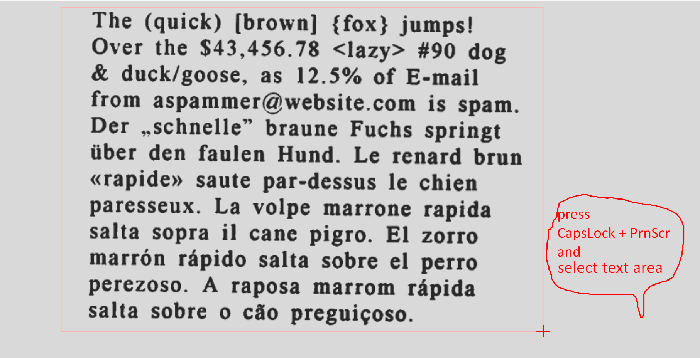
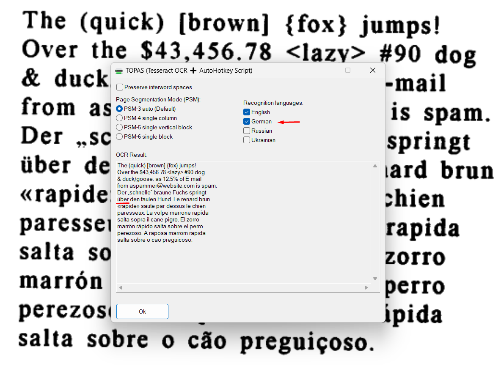
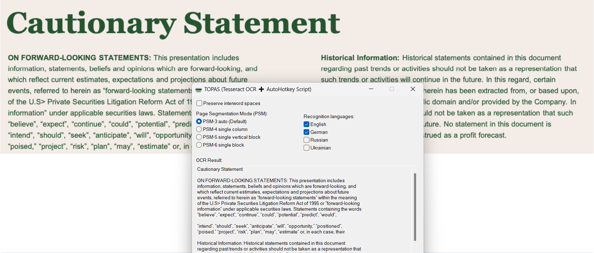
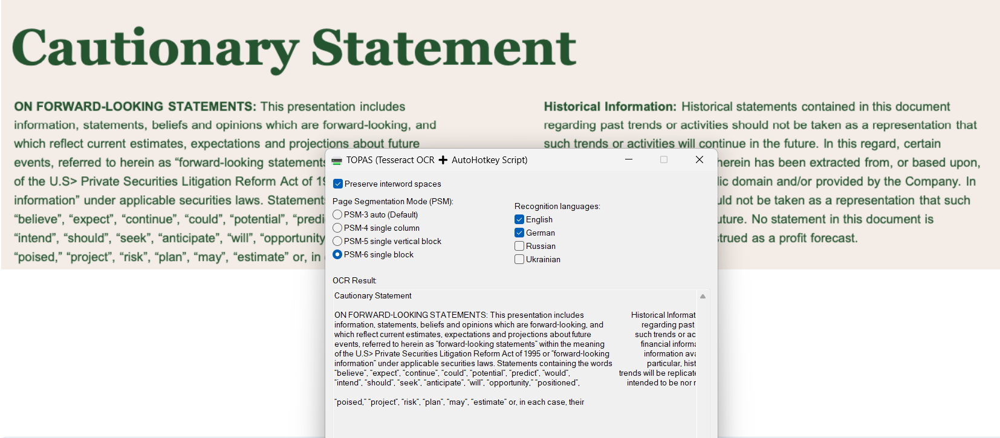
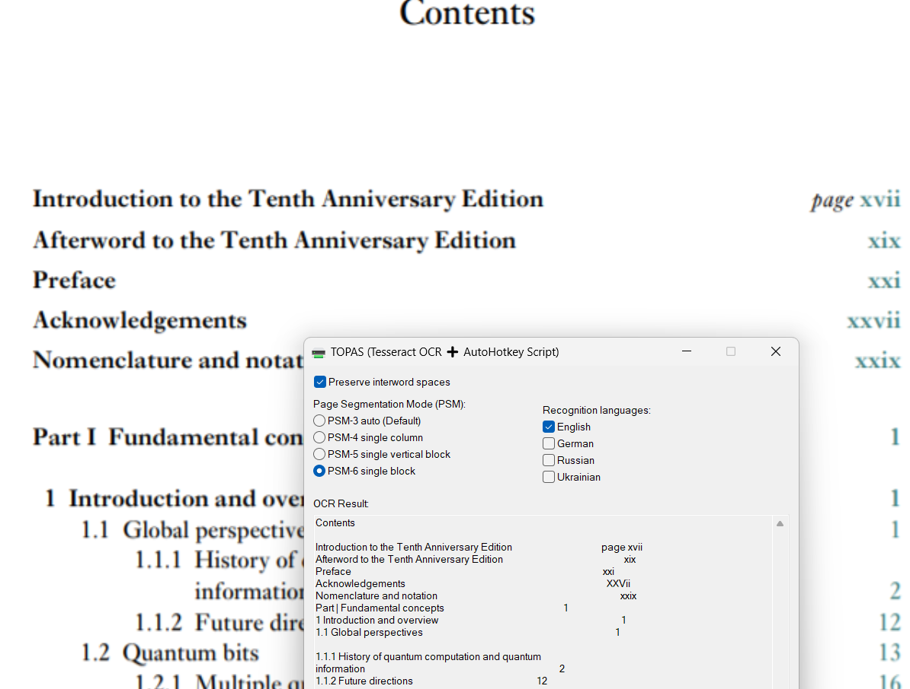

# 🔠 TOPAS  (Tesseract OCR + AutoHotkey Script)

TOPAS is an AutoHotkey v2 script that allows you to capture selected screen areas and perform OCR (Optical Character Recognition) using Tesseract. The script provides a convenient GUI for configuring recognition settings and runs minimized in the system tray.

## Features

- **Quick screenshot capture**: Use hotkey combination to capture screen areas
- **Multiple OCR languages**: Support for English, German, Russian, and Ukrainian
- **Flexible PSM modes**: Choose from different page segmentation modes
- **Settings persistence**: Your preferences are automatically saved and restored
- **System tray integration**: Runs minimized with easy access through tray menu
- **Clipboard integration**: Recognized text is automatically copied to clipboard

## Prerequisites

### ✅ Required Software

Make sure the following tools are installed and added to your system's `PATH`:

1. **[AutoHotkey v2](https://www.autohotkey.com/download/)**  
   Used to run the script.

2. **[Tesseract OCR](https://github.com/tesseract-ocr/tesseract)**  
   OCR engine. Install via [Tesseract installer for Windows](https://github.com/UB-Mannheim/tesseract/wiki).

3. **[Python](https://www.python.org/downloads/windows/)**  
   Required for screenshot functionality.

4. **screenshot.py**  
   Python script for capturing screenshots (must be in the same directory as topas.ahk).

### ⚙️ Optional

- Additional Tesseract language packs: `deu` (German), `rus` (Russian), `ukr` (Ukrainian)
- Ensure `python.exe` and `tesseract.exe` are accessible from command line

## Installation

1. Download or clone the repository containing `topas.ahk` and `screenshot.py`
2. Ensure all prerequisites are installed and in your system PATH
3. Double-click `topas.ahk` to run the script
4. The script will start minimized in the system tray

## Usage

### First Launch
- On first run, TOPAS displays a help dialog explaining the basic usage
- The script automatically creates a settings file in your temp directory

### Taking OCR Screenshots

1. **Trigger OCR**: Press `CapsLock + PrintScreen`
2. **Select area**: Use the screenshot tool to select the area you want to recognize
3. **Configure settings**: The GUI will appear with options for:
   - **Page Segmentation Mode (PSM)**:
     - PSM-3: Automatic (Default) - best for mixed text layouts
     - PSM-4: Single column - for single column text
     - PSM-5: Single vertical block - for vertical text blocks
     - PSM-6: Single block - for single uniform text blocks
   - **Recognition Languages**:
     - English, German, Russian, Ukrainian (can select multiple)
   - **Preserve interword spaces**: Maintains spacing between words
4. **View results**: OCR text appears in the result field and is copied to clipboard
5. **Click "Ok"** to close the GUI and save settings

### System Tray Menu

Right-click the tray icon to access:
- **Open Settings**: Opens the configuration GUI
- **Exit**: Closes the application

Double-click the tray icon to quickly open settings.

## Settings Management

### Automatic Settings
- All settings are automatically saved to `topas_settings.ini` in your temp folder
- Settings are restored when you restart the script
- Last used PSM mode and language selections are remembered

### Temporary Files
TOPAS creates temporary files in your system temp directory:
- `topas_screenshot.png` - captured screenshot
- `topas_result.txt` - OCR results
- `topas_log.txt` - Tesseract log output
- `topas_settings.ini` - your saved settings

## Tips for Best OCR Results

1. **Choose appropriate PSM mode**:
   - Use PSM-3 (default) for documents with mixed layouts
   - Use PSM-6 for single text blocks or simple layouts
   - Use PSM-4 for newspaper-style columns

2. **Language selection**:
   - Select only languages present in your text for better accuracy
   - Multiple language selection works well for multilingual documents

3. **Text quality**:
   - Ensure text is clearly visible and high contrast
   - Avoid blurry or heavily compressed images
   - Larger text generally produces better results

## Troubleshooting

If OCR fails:
1. Check that Tesseract and Python are properly installed and in PATH
2. Verify that `screenshot.py` is in the same directory as `topas.ahk`
3. Ensure you have the required language packs installed for Tesseract
4. Check the OCR result field for error messages

## File Structure
```
project-folder/
├── topas.ahk          # Main AutoHotkey script
├── screenshot.py      # Python screenshot utility
└── README.md         # This file
```

## License

MIT License. Feel free to modify and share.

## Screenshots



---



---



---



---



*OCR results displayed in the GUI with recognized text*
